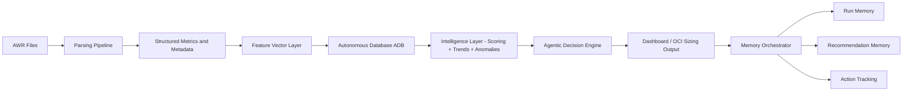
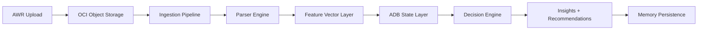
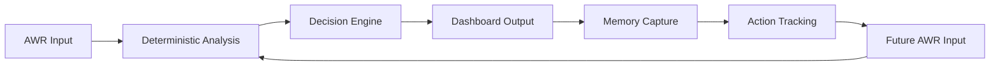
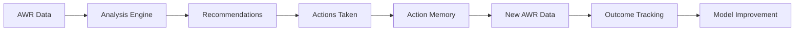

# Agentic AI AWR Advisor

  <b>From AWR Data to Deterministic Intelligence, Memory, and Action</b> 
  Autonomous Database Performance Intelligence Platform

  
  
  
  
  
  
  
  
  
  
  

---

# Executive Summary

The Agentic AI AWR Advisor is an Autonomous Database Performance Intelligence Platform that transforms Oracle AWR data into deterministic insights, autonomous decisions, actionable outcomes, and persistent memory.

It combines a deterministic analysis engine with an agentic AI layer and a Phase 6 memory layer to deliver:

- Root-cause diagnostics with full explainability  
- Prioritized and evidence-based recommendations  
- Autonomous decision support  
- Persistent run and action memory  
- Scalable, cloud-native performance intelligence  
- Built to operate reliably across heterogeneous AWR formats without requiring schema normalization or manual adjustment

> **This system replaces manual AWR interpretation with a repeatable, auditable, memory-backed, and automation-ready decision framework.**

---

## Executive Overview

The Agentic AI  AWR Sizing Advisor is a **deterministic + agentic AI + memory system** that transforms Oracle AWR reports into:

- Root-cause performance diagnostics  
- Prioritized remediation actions  
- AI-guided decision support  
- Infrastructure sizing recommendations  
- Action tracking and memory-backed intelligence  

This system eliminates subjective interpretation and replaces it with:

> **Repeatable, explainable, auditable, and automation-ready intelligence**

---

## Why This System Exists

Traditional AWR analysis suffers from:

- Manual interpretation  
- Inconsistent conclusions  
- Time-intensive workflows  
- Heavy reliance on expert intuition  
- No structured memory of prior runs, recommendations, or actions  

This platform introduces:

- Deterministic reasoning  
- Structured data pipelines  
- Automated analysis  
- AI-assisted interpretation  
- Persistent memory and action tracking  
- Scalable architecture for enterprise environments  

---

## Core Design Principles

- Deterministic analysis is the source of truth  
- AI augments interpretation, not facts  
- Memory is downstream and non-influencing  
- Stateless reasoning + stateful context (ADB)  
- No fabricated data or synthetic distributions  
- Observability-first architecture  
- Full auditability of decisions and actions  

---

## AWR Format Resilience (NEW)

AWR parsing is inherently **non-deterministic** due to format variability in report structure across database versions, configurations, and deployment topologies.

Observed sources of variability include:
- Version differences (11g, 12c, 19c, 23ai)
- Topology differences (Single Instance, RAC, Data Guard, Exadata)
- Feature-dependent sections (licensing / options enabled)
- Section ordering inconsistencies
- Formatting drift across patch levels and platforms

This variability makes position-based or rigid parsing approaches unreliable in production environments.

### Design Approach

The parsing engine is implemented using a **section-driven, pattern-based architecture.**

Key characteristics:
- **Section discovery via semantic headers**
Sections are identified using pattern matching rather than fixed offsets
- **Loose coupling between detection and extraction**
Section boundaries are resolved independently from parsing logic
- **Content normalization layer**
Raw text is sanitized to remove formatting artifacts and delimiters
- **Graceful degradation model**
Missing or partial sections do not interrupt ingestion
- **Deterministic extraction rules**
All parsed outputs are derived from explicit patterns (no inference)
- **Parse diagnostics and validation signals**
The system produces structured diagnostics for traceability and audit

### Operational Behavior
- Parsing is resilient to missing sections
- Partial data is still ingested and classified
- Invalid or ambiguous content is isolated without pipeline failure
- All outputs remain deterministic and reproducible

### Outcome
- Stable ingestion across heterogeneous AWR datasets
- Compatibility with mixed-version enterprise environments
- No dependency on a canonical AWR format

> **The system is engineered to operate on real-world AWR data, not controlled or idealized report structures.**

---

## End-to-End Architecture

### Data Flow

AWR (.out files)  
→ Parsing Layer  
→ Structured Metrics  
→ Feature Vector Layer  
→ ADB (State Layer)  
→ Scoring Engine  
→ Trend & Anomaly Engine  
→ Agentic Decision Engine  
→ Dashboard + OCI Sizing  
→ Memory Persistence  
→ Action Tracking  

---

## Architecture Diagram

---

## Object Storage Ingestion Flow (ADDED)

---

## AWR Intelligence Cycle

---

## Cloud-Native Design

The platform is designed as a cloud-native pipeline:

- Object Storage for raw AWR ingestion
- Autonomous Database (ADB) for state and analytics
- Deterministic parsing and feature extraction
- Scalable ingestion for multi-AWR workloads
- Persistent memory for run history, recommendations, actions, and unknown signals

**This enables enterprise-scale performance intelligence across environments.**

---

## Machine Learning Readiness

The feature vector layer and memory layer provide a foundation for:

- Similarity-based workload analysis  
- Pattern recognition across environments  
- Future supervised learning models  
- Outcome-based optimization  
- Memory-backed evaluation of actions and recommendations  

This **enables a transition from deterministic intelligence to adaptive learning systems.**

---

## Feature Vector System

Each AWR snapshot is transformed into a **feature vector** stored in:

- AWR_FEATURE_VECTOR

### Contents

- Raw extracted metrics  
- Engineered metrics  
- Derived ratios  
- Classification signals  

### Examples

- DB_CPU_PCT_DB_TIME  
- REDO_GENERATION_PER_SEC  
- CELL_SINGLE_BLOCK_LATENCY_MS  
- NETWORK_WAIT_PCT_DB_TIME  

### Purpose

Feature vectors enable:

- Scoring  
- Trend analysis  
- Similarity intelligence  
- ML readiness  

---

## Vector Intelligence Layer (ADDED)

The feature vector layer is the foundation for:

- Similarity search  
- Pattern clustering  
- Workload fingerprinting  
- Future supervised ML models  

---

## DB-Level Trend & Anomaly Engine

### Storage

Table:
- AWR_DB_METRIC_TREND  

Granularity:
- DB_NAME  
- DBID  
- METRIC_NAME  
- SNAP_BEGIN_TIME  

---

### Trend Computation

Each metric produces:

- Rolling mean  
- Rolling standard deviation  
- Slope (trend direction)  
- Percent change  
- Baseline mean / variance  

---

### Anomaly Semantics

#### Continuous Metrics

Detects:

- SPIKE  
- DROP  
- TREND_SHIFT  
- VOLATILITY_INCREASE  
- ZERO_ANOMALY  

#### State / Flag Metrics

Detects:

- ACTIVATED  
- CLEARED  
- STATE_CHANGE  

---

### Noise Control

- Absolute threshold gating  
- Low-variance suppression  
- History-aware anomaly detection  

---

## ADB (State Layer)

### Tables

- AWR_INGEST_RUN  
- AWR_SOURCE_SYSTEM  
- AWR_REPORT  
- AWR_METRIC_FACT  
- AWR_TOP_SQL_FACT  
- AWR_WAIT_EVENT_FACT  
- AWR_FEATURE_VECTOR  
- AWR_DB_METRIC_TREND  
- AWR_RUN_HISTORY  
- AWR_RECOMMENDATION_HISTORY  
- AWR_ACTION_HISTORY  
- AWR_UNKNOWN_SIGNAL_HISTORY  

---

### Capabilities

- Secure wallet-based connection  
- Transaction-safe ingestion  
- Time-series persistence  
- Analytical query layer  
- Memory persistence for run history and actions  
- Unknown signal capture for future parser and knowledge workflows  

---

## Deterministic Analysis Engine

Detects:

- CPU pressure  
- SQL concentration  
- I/O bottlenecks  
- Memory pressure  
- Commit latency  
- Concurrency contention  
- RAC interconnect stress  
- Exadata inefficiencies  
- Data Guard transport issues  

---

## Scoring Engine

- Weighted deterministic scoring  
- Risk classification  
- Confidence scoring  
- Domain scoring across CPU, IO, MEMORY, COMMIT, RAC, and ADG  

Used for:

- prioritization  
- decision ranking  
- deterministic posture selection  

---

## Recommendation Engine

- Deterministic mapping (issue → action)  
- Prioritized execution plans  
- Evidence-based recommendations  

Guiding principle:

> Fix workload before scaling infrastructure  

---

## AI Narrative Layer

Produces:

- Executive Summary  
- Root Cause Analysis  
- Action Plan  
- OCI Sizing Considerations  
- Confidence + Risk  

### Constraints

- No hallucinated metrics  
- No contradiction of facts  
- Fully grounded in deterministic outputs  
- LLM may vocalize phrasing, but cannot change deterministic meaning  

---

## Dashboard Layer

### Sections

- Screen 0 — System Overview and Navigation  
- Screen 1 — Ingestion / Parse Confidence / Adaptation  
- Screen 2 — Diagnostic Snapshot  
- Screen 3 — History Selector / Filter / Scope Definition  
- Screen 4 — Historical Review  
- Screen 5 — Recommendation / Action  
- Screen 6 — Fleet Overview  

### Rules

- No synthetic data  
- No interpolation  
- Only real AWR-derived signals  
- Memory is shown as system state only; it does not alter decisions  

---

## Multi-AWR Intelligence

Enables:

- Historical trend analysis  
- Cross-snapshot anomaly detection  
- Capacity planning  
- Similarity intelligence  
- Fleet-level pattern review  
- ML pipeline readiness  

---

## Learning Loop (ADDED)

---

## Agentic Model

This is not a chatbot.

This is:

- Deterministic reasoning engine  
- AI interpretation layer  
- Stateful memory system  

### Decision Flow

AWR → Metrics → Issues → Recommendations → AI → Decision → Memory → Action  

---

## Phase 6 — Memory & Action Tracking

The system now includes a structured memory layer:

- Run Memory (6G)  
- Action Tracking (6H)  
- Unknown Signal Capture  
- Recommendation memory persistence  

Memory is:

- Deterministic-safe  
- Non-influencing (does not affect scoring or decisions)  
- Fully auditable  

### Oracle Agent Memory (6N.1)

Oracle Agent Memory can be integrated as a non-authoritative augmentation layer:

- Provides contextual recall and conversational continuity  
- Enhances phrasing and interpretation only  
- Does NOT influence scoring, parsing, decisions, or recommendations  

This ensures strict separation between:

Deterministic Truth → Phase 4  
Memory & Context → Phase 6  
Adaptive Learning → Phase 7  

---

## Roadmap

### Phase 4
- Backend intelligence complete  
- Phase 4I output contract complete  
- Scoring, trend, anomaly, and decision layers complete  

### Phase 5
- Dashboard/product UI complete  
- Six-screen workflow complete  
- Historical review, action page, and fleet overview complete  

### Phase 6
- Run memory complete  
- Memory orchestrator complete  
- Action tracking complete  
- Outcome tracking next  
- Feedback capture planned  
- Oracle Agent Memory adapter planned as Phase 6N.1  

---

## Value Proposition

From AWR → Decision → Memory → Action → Outcome

This is NOT:

- A report  
- A chatbot  

This IS:

- Autonomous performance advisor  
- OCI sizing decision engine  
- Stateful memory-backed performance intelligence platform  

---

## Status

- Parsing: Complete  
- Feature Vectors: Complete  
- Scoring Engine: Complete  
- Trend Engine: Complete  
- Anomaly Detection: Refined  
- ADB Integration: Complete  
- Object Storage Integration: Complete  
- Dashboard Layer: Complete  
- Memory Persistence: Complete  
- Action Tracking: Complete  

Next:

- Outcome tracking  
- Feedback capture  
- Oracle Agent Memory adapter (6N.1)  
- Learning system  

---

## Quick Start

pip install -r requirements.txt  
python scripts/run_analysis.py  

---

## Project Structure

src/
  parser/
  analysis/
  reporting/
  memory/
scripts/
data/
dbschema/

---

## Final Statement

This project has evolved beyond reporting.

It is now:

**A deterministic intelligence platform with memory and action tracking, evolving into a fully autonomous decision and learning system.**
