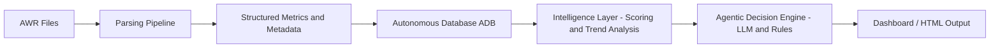

# OCI AWR Agentic AI Sizing Advisor

## Overview

The OCI AWR Agentic AI Sizing Advisor is an **agentic AI-driven platform** that transforms Oracle AWR reports into **structured intelligence and actionable performance and sizing decisions**.

It enables:
- Performance diagnostics  
- Multi-snapshot trend analysis  
- Decision-oriented insights  
- Infrastructure sizing guidance  

The architecture is **platform-agnostic** and can run across OCI, on-prem, and DB@X environments.

---

## Core Value Proposition

**From AWR → to insight → to decision**

- NOT a static report generator  
- NOT a chatbot  

This IS:

- An **autonomous performance and infrastructure sizing advisor**

---

## Architecture

### Data Flow

AWR (.out files)  
→ Parsing Pipeline  
→ Structured Metrics + Metadata  
→ Autonomous Database (ADB)  
→ Intelligence Layer (Scoring + Trend + Anomaly Detection)  
→ Agentic Decision Engine  
→ Dashboard / HTML Output  

---

## Architecture Diagram

---

## OCI Services (Current Implementation)

- Object Storage – raw AWR files  
- Autonomous Database (ADB) – structured storage  
- Python processing layer – parsing, scoring, and analytics  
- HTML dashboard – visualization  

---

## Current System Status

### Completed

- Parsing: Complete  
- ADB Ingestion: Complete  
- Multi-AWR Support: Implemented  
- Metadata Normalization: Complete  
- Deterministic Analysis: Complete  

- Feature Vector System: Implemented  
- Scoring Engine: Implemented  
- DB-Scope Trend Engine: Implemented  
- Anomaly Detection (Refined): Implemented  

### In Progress

- Dashboard Wiring (Trend + Anomaly Visualization)

### Planned

- Recommendation Persistence  
- Action Tracking  
- Outcome Tracking  
- Agentic Decision Layer (LLM + orchestration)  
- ML Feedback Loop  

---

## Key Capabilities

### Multi-AWR Time-Series Analysis

- Processes multiple AWR snapshots  
- Builds workload behavior over time  
- Enables trend analysis and anomaly detection  

---

### DB-Level Trend & Anomaly Engine

- Table: AWR_DB_METRIC_TREND
- Rolling Mean, Std, Slope, Percent Change
- Continuous anomalies: SPIKE, DROP, TREND_SHIFT, VOLATILITY_INCREASE, ZERO_ANOMALY
- State anomalies: ACTIVATED, CLEARED, STATE_CHANGE

---

## Execution Modes

### Feature Rebuild
AWR_MAINTENANCE_MODE=REBUILD_FEATURE_VECTORS

### Trend Analysis
AWR_MAINTENANCE_MODE=DB_TREND_ANALYSIS

Optional:
AWR_TREND_METRIC_NAME=DB_CPU_PCT_DB_TIME

---

## Roadmap

Phase 4: Dashboard Wiring  
Phase 5: Recommendation Engine  
Phase 6: ML + Outcome Tracking  

---

## Status Summary

Production-grade analytical backend complete.
Next phase: visualization and decision surfacing.
